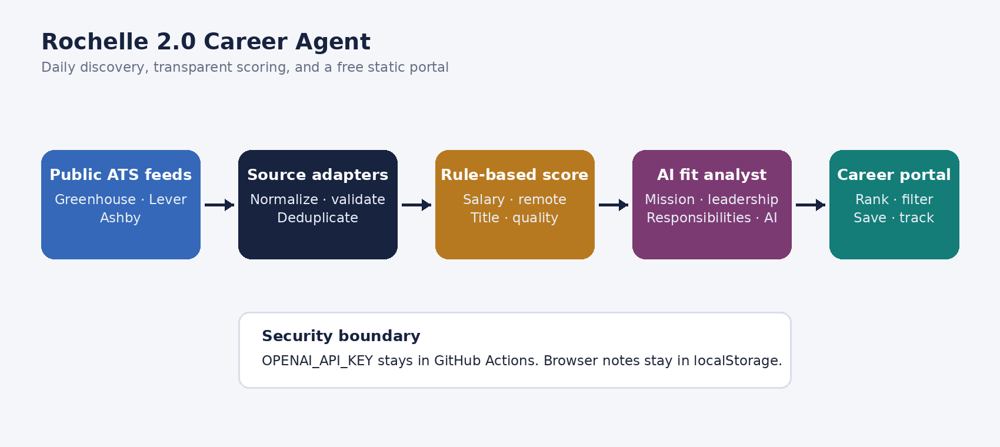
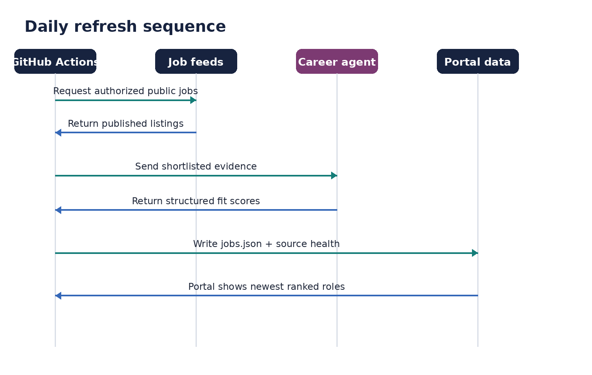

# Rochelle 2.0 — AI Career Agent

An automated career-discovery and job-matching portal built for Rochelle Mickels' AI career transition. The system checks employer-authorized public career feeds, normalizes open roles, scores every role against Rochelle's goals, and publishes the strongest opportunities first.

## What it does

- Refreshes configured Greenhouse, Lever, and Ashby public job feeds every day.
- Prioritizes strategic partnerships, business development, revenue/growth strategy, customer-success leadership, go-to-market, and AI-transformation roles.
- Applies a transparent 100-point Rochelle Match Score.
- Uses one OpenAI Agents SDK analyst for nuanced responsibility, values, leadership, and AI-fit review.
- Publishes a responsive GitHub Pages dashboard with search, filters, and score explanations.
- Saves favorites, application stages, and private notes only in the current browser.
- Reports broken company feeds without allowing one failure to stop the full refresh.

## Rochelle Match Score

| Category | Points | High-score evidence |
|---|---:|---|
| Role and experience fit | 25 | Partnerships, business development, revenue/growth, executive relationships |
| Compensation | 20 | Published base range reaches or exceeds $150,000 |
| Remote and location | 15 | U.S. remote first; DFW hybrid second |
| Core values and mission | 15 | Ethical, inclusive, mission-driven customer or community impact |
| Leadership and influence | 10 | Strategic ownership, cross-functional leadership, executive visibility |
| AI and future-facing work | 10 | AI strategy, transformation, automation, or digital innovation |
| Stability and posting quality | 5 | Clear, credible, detailed employer posting |

The agent never invents salary, remote status, values, responsibilities, or requirements. Missing details remain visible as gaps.

## Architecture





The OpenAI API key is used only by the server-side GitHub Actions workflow. It is never included in the public website, repository files, or browser JavaScript.

## One-time launch steps

1. Merge the implementation pull request into `main`.
2. Open **Settings → Pages** in this repository.
3. Under **Build and deployment**, set **Source** to **GitHub Actions**.
4. Open **Actions → Refresh career opportunities → Run workflow**.
5. Keep **Use the OpenAI Career Fit Agent** checked and select **Run workflow**.
6. When both workflows finish, open:
   `https://rochellemickels.github.io/rochelle-2-career-agent/`

The encrypted repository secret must be named exactly `OPENAI_API_KEY`. API usage is billed separately from ChatGPT Plus.

## Change the career criteria

Edit [`config/profile.json`](config/profile.json) to change:

- target and adjacent titles;
- salary threshold;
- score keywords and weights;
- DFW location terms;
- AI review limit and model.

Weights must continue to total 100 points and match the allowed category maximums in `ScoreBreakdown`.

## Add or remove target companies

Edit [`config/sources.json`](config/sources.json). Each company needs a public ATS type and its board slug:

```json
{
  "company": "Example",
  "type": "greenhouse",
  "slug": "example",
  "careers_url": "https://example.com/careers",
  "priority": 1
}
```

Supported public feed types are `greenhouse`, `lever`, and `ashby`. A company's own careers URL does not always equal its ATS slug; source health makes incorrect or changed slugs visible.

## Run locally

Python 3.11+ is required.

```bash
python -m venv .venv
source .venv/bin/activate
python -m pip install -e .
python -m unittest discover -s tests -v
python -m rochelle_agent.scan --no-ai
python -m http.server 8000 --directory docs
```

Open `http://localhost:8000`. To use AI locally, provide `OPENAI_API_KEY` through your shell or an ignored environment file; never commit it.

## Automation

- `Refresh career opportunities` runs daily at 12:30 UTC and can be started manually.
- Unchanged AI assessments are reused using a content fingerprint to control cost.
- Only promising new or changed roles are sent to the agent, capped by `max_jobs_per_refresh`.
- `Deploy career portal` publishes after code changes and successful database refreshes.

## Privacy and limitations

This V1 repository is public to support free GitHub Pages hosting. The committed dataset contains public job postings and generic career-fit criteria only. Favorites, notes, and application stages remain in browser `localStorage`; clearing browser data removes them.

The portal is decision support—not a promise that a job remains open or that compensation, eligibility, or employer fit has been verified beyond the cited posting. Applications are always opened on the employer's authorized page and are never submitted automatically.

